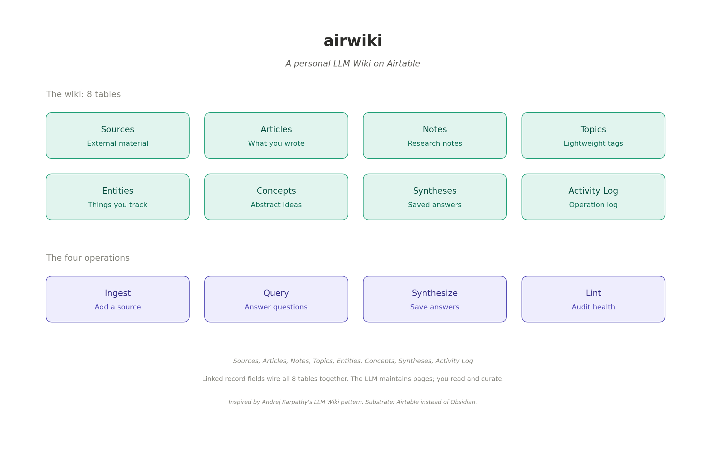

# airwiki

A personal LLM Wiki built on Airtable.

> Read articles, papers, podcasts, anything. Have an LLM agent ingest each one, decompose it across pages of a structured wiki, surface contradictions, file synthesized answers back. Your second brain compounds slowly and quietly across every device.

Inspired by [Andrej Karpathy's LLM Wiki](https://gist.github.com/karpathy/442a6bf555914893e9891c11519de94f) pattern. Adapted from local Markdown files to Airtable for cross-device cloud-native operation.

---

## TL;DR

You read constantly. You want it to compound into a structured, queryable second brain instead of disappearing into a folder of bookmarks.

The LLM Wiki pattern says: an LLM can do all the bookkeeping (cross-referencing, summarizing, contradiction-flagging, page maintenance) that humans abandon. The wiki becomes a persistent, compounding artifact: interlinked pages that get richer with every source you add.

**airwiki** uses Airtable instead of Obsidian. You lose Obsidian's local-first storage and graph view. You gain mobile/web access from any device, structured queries, enforced bidirectional links, and one-click sharing. The LLM runs through MCP, so any agent that supports Airtable MCP can read and write your wiki: Claude Code, Cursor, Claude Desktop, OpenCode, Codex.

## What's in this repo

- **`setup-prompt.md`** — paste this into your LLM agent of choice. It walks you through building the entire system in your Airtable account in 30-60 minutes.
- **`skill/SKILL.md.template`** — a placeholder skill skeleton for agents that want a visible starting point. It is not install-ready until an executing setup agent replaces the placeholders with IDs from your Airtable base.
- **`architecture.png`** — the architecture diagram used in this README.
- **`README.md`** — what you're reading now. The architecture description.
- **`LICENSE`** — MIT.

The repo is intentionally template-only. Cloning or editing it should not create Airtable resources. Your data lives in your Airtable account, and generated skill files with real base/table/field IDs live in your project knowledge or skill installation. Nothing personal goes here.

## Why airwiki exists

Most LLM-powered knowledge tools work via RAG. Documents get chunked, indexed, retrieved at query time, synthesized fresh for every question. The LLM rediscovers knowledge from scratch on every query. Nothing accumulates.

The LLM Wiki pattern is different. The LLM **incrementally builds and maintains** a persistent knowledge structure. Each new source doesn't just get stored. It gets decomposed into updates across many existing pages. Entity pages get richer. Concept pages absorb new evidence. Contradictions surface. Cross-references multiply. The wiki compounds.

Karpathy's original instantiation uses Obsidian. airwiki uses Airtable. The pattern is the same; the substrate is different.

## Architecture

Three layers, like Karpathy's original.

**Raw sources (immutable).** Articles, papers, podcasts, transcripts, internal documents — whatever you read. These live wherever they natively live. The wiki holds *records about* these sources (URL, summary, key quotes, metadata) but does not necessarily replicate full content.

**The wiki (LLM-maintained).** An Airtable base with eight tables. The LLM owns this layer. It creates records, updates them when new sources arrive, maintains linked record relationships, keeps everything consistent.

**The schema (skill).** A SKILL.md (or CLAUDE.md, AGENTS.md, depending on your agent) that tells the LLM how the wiki is structured, what trigger phrases mean, how to ingest sources, how to query, how to lint, what constraints apply.

## The eight tables

| Table | What it holds | Page or record? |
|---|---|---|
| **Sources** | External material you read or reference | Record (metadata + summary, not full content) |
| **Articles** | Pieces *you* have written or are drafting | Page (full body in richText) |
| **Notes** | Research notes, observations, captured conversations | Page (full body) |
| **Entities** | People, organizations, products, places, events, tools | Page (body grows over time as sources mention them) |
| **Concepts** | Abstract ideas, methodologies, frameworks | Page (body compounds as you read more) |
| **Syntheses** | Refined answers to questions you've asked the LLM | Page (citations to all contributing sources) |
| **Topics** | Lightweight tags | Tag only (no body) |
| **Activity Log** | Append-only operational history | Log entries |

The distinction between Entities/Concepts (which have bodies that get *maintained*) and Topics (which are just tags) is what makes this a wiki rather than a CRM. Entity and concept pages are the things that compound.

Articles are distinct from Sources because Articles are things *you wrote* and Sources are things *others wrote* that you've read. Some wikis collapse these into one table; keeping them separate makes the line clearer for personal use.

Syntheses is the most underrated table. When you have a useful conversation with the LLM about, say, "how does X compare to Y," that conversation usually disappears into chat history. Syntheses captures it as a page, with citations to all the source records that informed the answer, so future you can find it again.

## The four operations

This is what the LLM does on your behalf.

### INGEST

You drop a new source: a URL, a PDF, a YouTube video, a podcast transcript, an internal document. You tell the LLM "ingest this."

The LLM reads the source, drafts a Source record with summary and key quotes, then **discusses key takeaways with you before writing anything else**. Karpathy's pattern is explicit: discussion comes first, page updates second. You confirm or redirect.

Then the LLM identifies which existing pages this source affects: which Entities does it mention? Which Concepts does it advance, refine, or contradict? Which Articles or Notes does it relate to? Which Topics tag it?

For each affected page, the LLM updates the Body field — adding new perspectives, citing the source, flagging contradictions explicitly. New Entity or Concept pages get created if the source introduces things worth tracking that don't yet have pages.

A single source might touch 5-15 pages. That's normal and is the whole point. The wiki compounds.

The Activity Log gets an entry: `YYYY-MM-DD Source Ingested: [Title] | touched 7 pages: [list]`.

### QUERY

You ask a question against the wiki: "What do I know about X?" / "How does A relate to B?" / "Show me my view on Z."

The LLM searches the wiki, reads the relevant pages, and synthesizes an answer with inline citations to specific records. Every substantive claim references the page or source it came from.

If the wiki doesn't have enough information, the LLM says so plainly and suggests sources to ingest that would fill the gap. No fabrication.

At the end of every substantial answer, the LLM offers: "Worth saving as a Synthesis page so it compounds in the wiki?" If yes, run the next operation.

### SYNTHESIZE-AND-FILE

You agree (or proactively request) to file the answer as a Synthesis. The LLM creates a Synthesis record with the answer body, sets linked record fields to all the contributing pages, logs the operation. Now the answer is part of the wiki, retrievable next time, citable when relevant.

This is the operation that stops good explorations from disappearing into chat history. It's quietly the most valuable workflow because it's the one humans never do for themselves: synthesizing is fun, filing the synthesis is tedious. The LLM handles the tedious part.

### LINT

You ask the LLM to audit the wiki periodically. "Lint the vault" / "Health check" / "What's stale?"

The LLM scans for orphan pages, stale pages, concepts mentioned in body fields but lacking their own pages, sources never decomposed into other pages, possible contradictions, missing citations, broken cross-references, and naming inconsistencies. It returns findings as a numbered list with suggested fixes. You approve which to apply.

Lint is manual, not automatic. Run it monthly, or whenever the wiki feels messy.

## How daily usage feels

Once the schema is set up and the skill is loaded, daily usage is conversational. No menus. No databases to navigate. You just talk.

- *"Just read [article]. Ingest it."* — INGEST runs.
- *"Add a note: [voice memo transcription]"* — NOTE created.
- *"What's the connection between X and Y?"* — QUERY runs, citing pages.
- *"Save this answer."* — SYNTHESIZE-AND-FILE runs.
- *"Promote [recurring term] to a Concept page."* — Concept created from accumulated mentions.
- *"Lint the wiki."* — LINT runs, returns findings.

The wiki compounds slowly. After a month of daily use, ~50-100 records and the cross-references start revealing patterns. After six months, ~500-1,000 records and the wiki becomes a real second brain. After two years, it's the primary place you go to think about your domain.

## Why Airtable instead of Obsidian

| Dimension | Obsidian (Karpathy's original) | Airtable (airwiki) |
|---|---|---|
| Storage | Local files | Cloud, multi-device |
| Wiki-links | `[[Page Name]]` inline + graph view | Linked record fields (foreign keys) |
| Body editing | First-class markdown editor | Rich text cell editor, workable but cramped |
| Portability | `.md` files, trivial to grep/backup/git | Cloud database; export to markdown is a deliberate operation |
| Versioning | Git for free | 2 weeks free, 1 year on paid plan |
| Sharing | Manual file sync or paid Sync | One-click invite with granular permissions |
| Search | Plain-text grep + plugins | Built-in full-text + filtered views |
| Graph view | Yes | No (would need external tool) |
| Structured queries | Plugins (Dataview) | Native filter, sort, group on any field |
| Linked records | Wiki-links (manual to maintain, can break) | Foreign keys (enforced, bidirectional auto-maintained) |
| MCP integration | Via plugins (varies) | Native, well-supported |

**Pick Obsidian if:** you work mostly on one machine, you write a lot of long-form prose directly in your wiki, you value the graph view as a thinking tool, you want git-friendly portability above all else.

**Pick airwiki if:** you work across multiple devices (web/mobile/desktop), you want to share parts of the wiki with collaborators (advisor, team), you need structured queries (filter by date, group by status, count by category), you prefer enforced relational integrity, you want any LLM agent with Airtable MCP to be able to read and write your wiki.

Both are legitimate. The pattern works in either substrate.

## Getting started

Clone or download the template from [github.com/nik-kale/AirWiki](https://github.com/nik-kale/AirWiki), then run the setup prompt in an agent that has Airtable MCP access. The repository itself does not contain a live Airtable base and does not perform setup automatically.

### Prerequisites

- An [Airtable](https://airtable.com) account. Free tier works for the first ~1,000 records; the Team plan ($20/user/month annually) raises the cap to 50,000 plus full-year revision history.
- An LLM agent with Airtable MCP enabled. Options that work: Claude Desktop, Claude Code, Cursor with Claude, OpenCode, Codex.
- 30-60 minutes for the initial setup conversation.

### Setup steps

1. Clone or download this repo.
2. Open your LLM agent. If using Claude Code or Cursor in an IDE, place `setup-prompt.md` at the project root.
3. Tell the agent: *"Read setup-prompt.md and walk me through setup."* Or paste the contents of the prompt directly into a fresh chat.
4. Answer the agent's scope questions (base name, domains, constraints).
5. The agent creates the Airtable base, tables, fields, and linked record relationships.
6. The agent generates a SKILL.md tailored to your specific base IDs and field IDs.
7. Install the SKILL.md as a skill in your LLM agent (and, for current Claude.ai, also upload it to project knowledge as a workaround for skill body reachability — see notes in `setup-prompt.md`).
8. Test with a small ingestion. The agent walks you through.

After setup, daily usage happens conversationally in your LLM agent. The IDE is no longer needed. The skill triggers when you talk about ingesting, querying, syntheses, or wiki maintenance.

## Honest limitations

A pointed critique on Karpathy's original gist (from commenter @a-a-k):

> "An LLM Wiki is lossy compression. You take raw documents and rewrite them into derived wiki pages. That may be useful for a small curated corpus, but it can also drop caveats, dates, minority views, exact wording, edge cases, and source context. Once people start querying the wiki instead of the original material, summary errors become part of the knowledge base."

This is accurate. Mitigations:

- **Strict citation discipline.** Every claim links to a source. The wiki page is a compressed view; the source is the ground truth.
- **Sources table preserves originals.** Source records hold the URL, summary, and key quotes. When stakes are high, go back to the source.
- **Treat Synthesis pages as starting points, not authoritative.** A Synthesis is your evolving understanding, not the final word.
- **Manual lint passes** catch contradictions and stale claims before they propagate.

The pattern works well for single-user, slow-moving, human-curated knowledge bases at the scale of a few hundred to a few thousand records. It does NOT work for high-volume multi-user real-time knowledge bases (use proper RAG infrastructure), domains where exact original wording is legally significant (use the source, not the summary), or cases requiring fine-grained access control (Airtable's permissions are coarse).

There's also vendor lock-in to consider. Airtable holds your data. If Airtable disappears or pricing becomes prohibitive, you'd need to export and rebuild elsewhere — possible but not free. Periodic CSV exports as backups are smart practice.

## What this is NOT

- **Not a replacement for RAG.** RAG works on raw documents; airwiki works on a curated, derived knowledge layer. Different problems.
- **Not an enterprise knowledge management system.** The single-user, single-curator model is core to the pattern.
- **Not real-time.** The wiki updates when you tell it to. There's no continuous ingestion pipeline.
- **Not magic.** The LLM still needs accurate sources, careful curation, and your judgment. It does the bookkeeping; you do the thinking.

## Credits and lineage

- **Andrej Karpathy** for the [LLM Wiki gist](https://gist.github.com/karpathy/442a6bf555914893e9891c11519de94f) that articulated the pattern.
- **The community implementations** in the gist comments (Kompl, SwarmVault, Aura, Link, Synthadoc, NEXUS, and others) that explored variations and surfaced edge cases.
- **Vannevar Bush's Memex** (1945) for the original vision of personal, curated knowledge stores with associative trails. Bush couldn't solve who does the maintenance; LLMs can.
- **Obsidian** for proving that a markdown-files-and-wiki-links substrate can scale to serious personal knowledge work.
- **Airtable** for being a database that's actually pleasant to use across devices.
- **Anthropic** for Claude and the MCP protocol that makes this composable.

## License

MIT. See `LICENSE`. Use freely. Adapt liberally. The pattern is more valuable than any specific implementation.

## Contributing

This is a personal knowledge management pattern, not a software product. There's no "contributing" in the traditional sense. If you build a variation, share it. If you find a tradeoff or limitation that's not documented here, raise an issue or open a PR. If your domain or workflow suggests schema changes, the schema in `setup-prompt.md` is a starting point — adapt it.

## For maintainers

Keep this repository clean as a public template. Do not commit private Airtable data, real workspace/base/table/field IDs, OAuth credentials, generated personal `SKILL.md` files, Airtable exports, or source summaries from a user's wiki. Placeholder examples are fine; live setup artifacts belong in the user's own environment.

## Status

v0.1 of the architecture. Expect refinements as people use it and surface edge cases. The skill design pattern in particular is still settling — community feedback welcome.

---

*If you build this and learn something, write it up. The pattern compounds when others share their variations.*
